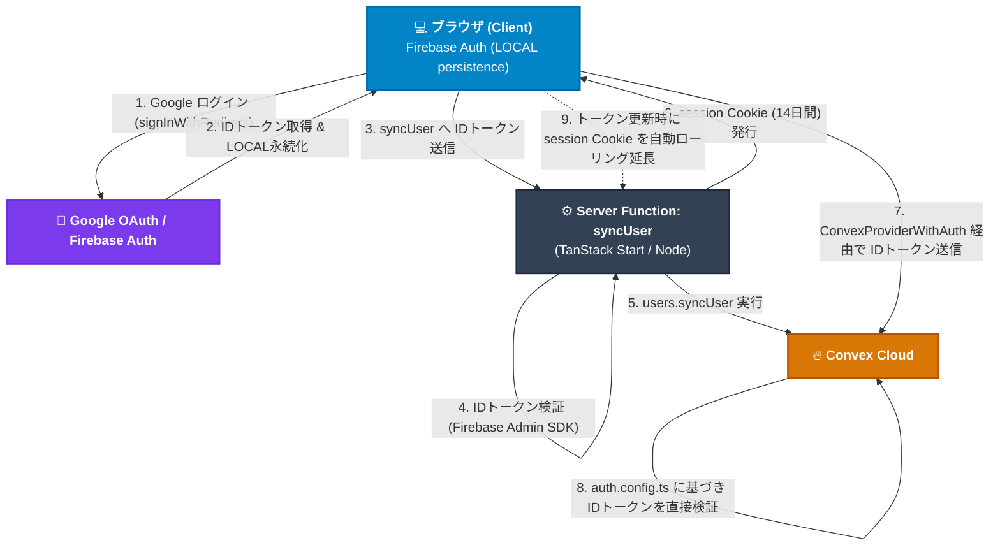
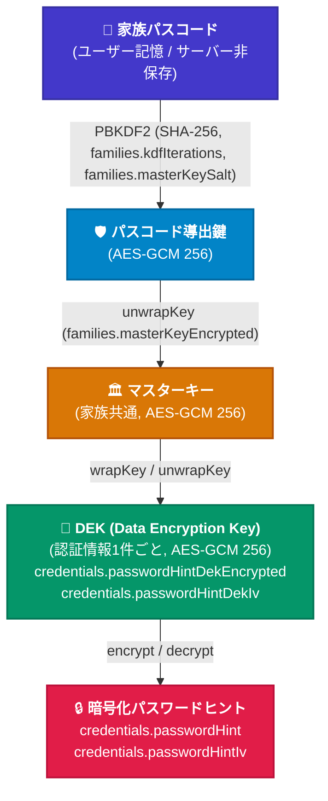

# PoohMa Architecture

## 1. Monorepo & Workspace Structure

本プロジェクトは **pnpm workspace + Turborepo** によるモノレポ構成。

```text
poohma/
├── apps/
│   └── web/               # @poohma/web (TanStack Start + Convex)
│       ├── convex/        # Convex バックエンド (schema, functions, RLS, customBuilders)
│       ├── src/           # フロントエンドおよび Server Functions
│       └── tests/         # テスト群 (Vitest / convex-test)
├── workers/
│   └── backup/            # @poohma/backup (Cloudflare Workers + R2 定期自動バックアップ)
├── .docs/                 # 人間向けの正規仕様・設計書
├── .ai/                   # AI Agent向けの実践知識ベース
├── GEMINI.md              # 実行環境ルール・QA・Git・.ai/利用規約
├── biome.json             # 統一 Lint / Format 設定
├── turbo.json             # Turborepo パイプライン設定
└── package.json           # ルートスクリプト
```

### Workspaceの責務

| Workspace | 責務 | 主要技術 |
| --- | --- | --- |
| `apps/web` | メインWebアプリケーション（フロントエンド、SSR、Server Functions、Convex BaaSバックエンド） | React 19, TanStack Start, TanStack Router, Convex, Tailwind CSS v4, shadcn/ui, Web Crypto API |
| `workers/backup` | Convex Cloud からの定期データエクスポートおよび Cloudflare R2 へのアーカイブ保存 | Cloudflare Workers, Cloudflare R2, Wrangler, Fetch |

---

## 2. Frontend / Backend 構造

### Frontend (`apps/web/src`)

- **Routing**: TanStack Router によるファイルベースルーティング
  - `routes/(app)/`: 認証必須ルート（`dashboard.tsx`, `family.tsx`, `records/`, `settings.tsx`, `recovery.tsx`）
  - `routes/(public)/`: 未認証公開ルート（`index.tsx` (LP), `login.tsx`, `usage.tsx`, `faq.tsx`, `terms-of-service.tsx`, `privacy-policy.tsx`）
  - `routes/__root.tsx`: ルート共通レイアウト、認証コンテキスト（`beforeLoad` で `getAuthUser` 実行）、各種 Provider
- **State & Context**:
  - `AuthProvider`: Firebase Auth 状態管理
  - `AccountProvider`: 1 Firebase UID : N PoohMa Account のアクティブアカウント管理・切り替え
  - `PasscodeProvider`: E2EEマスターキーのインメモリ保持、ロック状態管理、誤入力バックオフ
- **Services (Server Functions)**:
  - `auth.functions.ts`: `syncUser`, `refreshSessionCookie`, `getAuthUser`, `logout`, `getCustomTokenFromSession`（Firebase Admin SDK とセッション Cookie 制御）
  - `firebase-admin.server.ts`: Firebase Admin 初期化・トークン検証
  - `cms.functions.ts` / `cms.server.ts`: microCMS 連携（FAQ/利用規約等）
- **Lib & Utils**:
  - `crypto.ts`: Web Crypto API による E2EE（AES-GCM, PBKDF2, DEK/MasterKey ラップ/アンラップ）
  - `biometric.ts`: WebAuthn PRF 拡張による生体認証連携
  - `recovery-kit.ts`: リカバリーキット発行・PDF 生成・2段階復元

### Backend (`apps/web/convex`)

- `schema.ts`: データベーススキーマおよびインデックス定義
- `customBuilders.ts`: 認可レベル別 Convex クエリ/ミューテーションビルダー（`identityVerified*`, `authenticated*`, `familyBound*`, `resolveAccount`）
- `rls.ts`: レコード単位のアクセス制御関数（`requireContentAccess`, `requireAdminAccess`, レガシー互換ヘルパー）
- `records.ts`: サービスレコード CRUD、検索、タグ、一括操作
- `families.ts`: 家族グループ、家族招待（`familyInvites`）、参加申請（`joinRequests`）、家族移行（`familyMigrations`）、パスコードローテーション、メンバーキック・データ持ち出し（`pendingExportVaults`）
- `users.ts`: ユーザー同期、アカウント作成・切り替え・削除、ログイン履歴記録、SSR用ユーザー/アカウント（family暗号化メタデータ含む）取得
- `recovery.ts`: リカバリーキット検証、2段階復元（メールOTP発行・検証、マスターキー再ラップ）
- `actions.ts`: Node.js ランタイムでの外部連携（OGP取得、ふりがなAPI、Resend メール送信）
- `http.ts`: 内部 HTTP エンドポイント（`getUserByFirebaseUid`、内部共有シークレット認証）
- `crons.ts`: 定期バッチジョブ（期限切れ移行データやセッション、期限切れ Export Vault のクリーンアップ）

---

## 3. 認証・認可アーキテクチャ

### 認証要素の責務分離（4層モデル）

| 認証要素 | 役割 | 保持期間 | 責務と位置付け |
| --- | --- | --- | --- |
| **Firebase Auth** | 長期ログイン状態の本体 | 数ヶ月単位（無期限） | **Single Source of Truth**。IndexedDB + LocalStorage 永続化によりブラウザ側で長期間維持。 |
| **Firebase ID Token** | Convex バックエンドへの通信認証 | 1時間（SDK自動更新） | Convex への WebSocket/HTTP 通信時に付与され、Convex 側 OIDC 検証で直接認証。 |
| **session Cookie** | SSR初期表示・Server Function用キャッシュ | 14日間（自動ローリング延長） | サーバー側補助セッション。Cookie の期限切れのみでログアウト扱いにしてはならない。 |
| **Custom Token** | Client Auth 消失時のリカバリ | 一時発行（1回限り） | ブラウザストレージの揮発時に session Cookie から Client Auth を復旧するための非常用経路。 |

### 認証フロー



### 認可階層（Convex customBuilders）

1. `identityVerifiedQuery / Mutation`: Firebase Identity の存在のみを検証（新規ユーザー登録等）
2. `authenticatedQuery / Mutation`: Identity 検証 + `resolveAccount` によるアカウント所有権チェック（IDOR 防止）
3. `familyBoundQuery / Mutation`: 上記 + 対象アカウントが家族グループ（`familyId`）に所属していることを強制

---

## 4. E2EE（暗号化）アーキテクチャ

### 鍵階層（エンベロープ暗号化）



### 生体認証（WebAuthn PRF拡張）の正確な位置づけ

> [!IMPORTANT]
> **WebAuthn PRF 拡張は「家族パスコードのローカル保管（平文パスコードの暗号化保存）」にのみ使用される。**
> 認証処理やマスターキーの導出・バイパスには直接関与しない。
> PRF 出力鍵でローカルに暗号化保存された家族パスコードを復号し、得られたパスコードを通常の `unlock(passcode)` フロー（PBKDF2 鍵導出以降）に入力してマスターキーを展開する。

---

## 5. 主要な Source of Truth

| 領域 | Source of Truth |
| --- | --- |
| DB スキーマ・インデックス | `apps/web/convex/schema.ts` |
| Convex 認証・認可基盤 | `apps/web/convex/customBuilders.ts` |
| レコード単位アクセス制御 (RLS) | `apps/web/convex/rls.ts` |
| E2EE 暗号化・鍵導出アルゴリズム | `apps/web/src/lib/crypto.ts` |
| 脅威モデル・セキュリティ境界 | `.docs/security/threat-model.md` |
| 人間向け正規仕様・詳細設計 | `.docs/requirements.md`, `.docs/code-design.md` |

---

## 6. 変更時に関連確認が必要な領域

- **DB スキーマ変更時**:
  - `apps/web/convex/schema.ts` 変更後、必ず `pnpm convex:sync`（または `pnpm convex:codegen`）を実行して `_generated/` を最新化した後、 `pnpm check` でフォーマット
  - 影響を受ける Convex 関数（`records.ts`, `families.ts`, `users.ts` 等）およびフロントエンドの型参照
  - `.docs/code-design.md` の DB スキーマ表の更新要否
- **所有権・アクセス制御変更時**:
  - `apps/web/convex/rls.ts`, `apps/web/convex/customBuilders.ts`, `apps/web/convex/records.ts`
  - `.docs/security/threat-model.md` の脅威シナリオ（T6, T8）との整合性確認
- **E2EE / 暗号パラメータ変更時**:
  - `apps/web/src/lib/crypto.ts`（`KDF_VERSIONS` への追記、既存パラメータの不変性維持）
  - リカバリーキット（`recovery-kit.ts`, `recovery.ts`）への波及確認
- **認証・セッション変更時**:
  - `apps/web/src/services/auth.functions.ts`, `firebase-admin.server.ts`, `useConvexFirebaseAuth.ts`, `AccountProvider.tsx`
