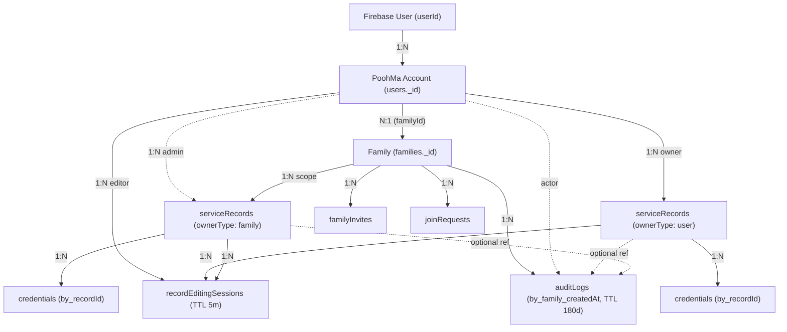
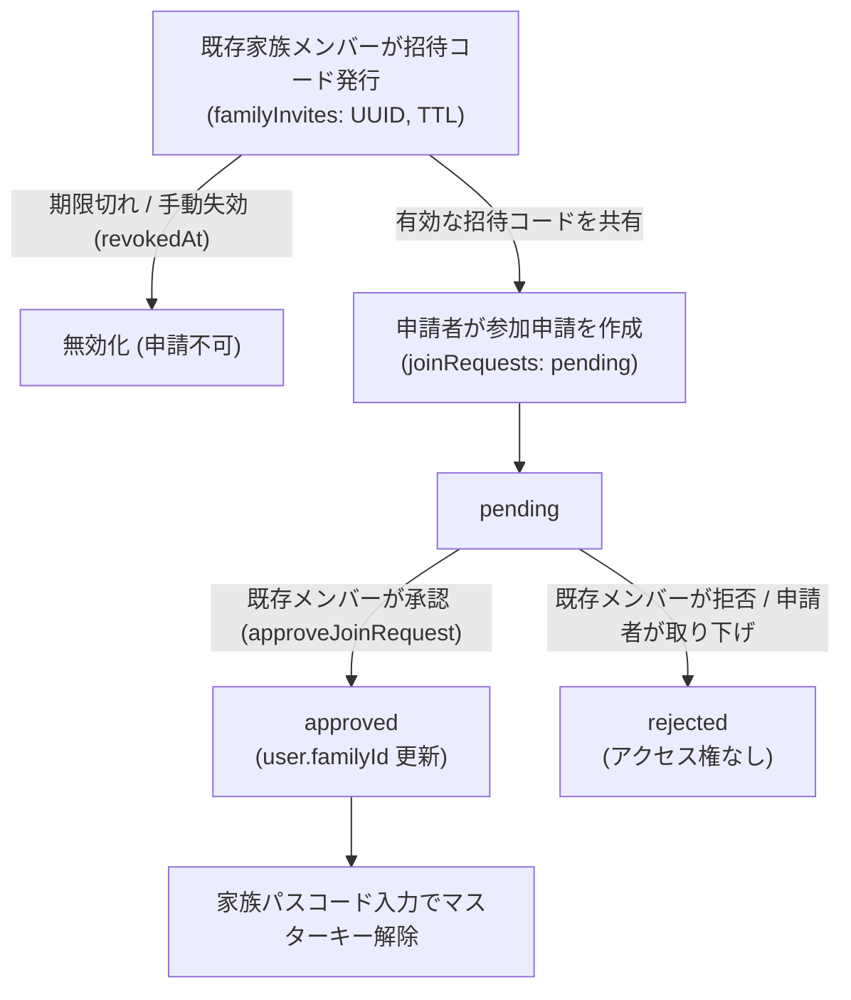
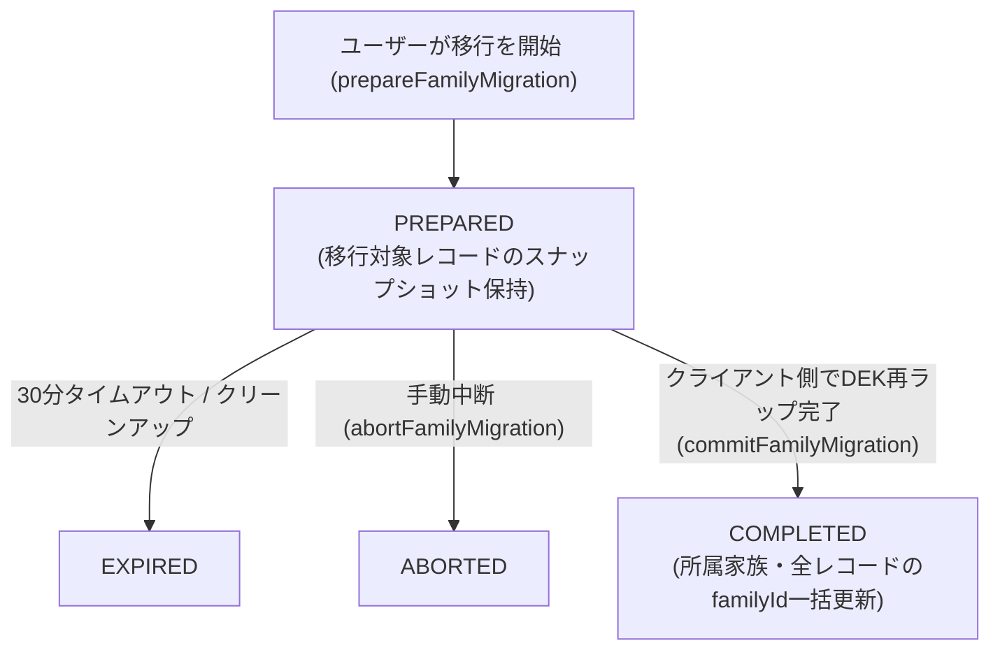
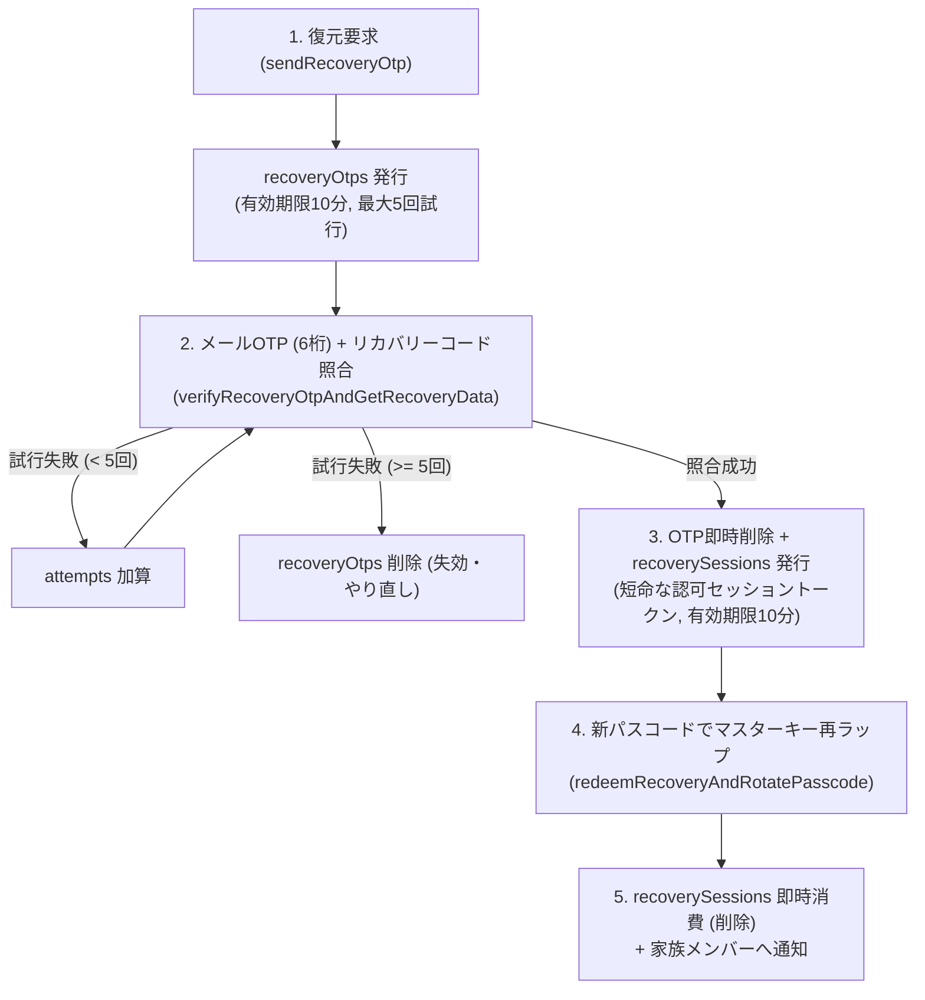
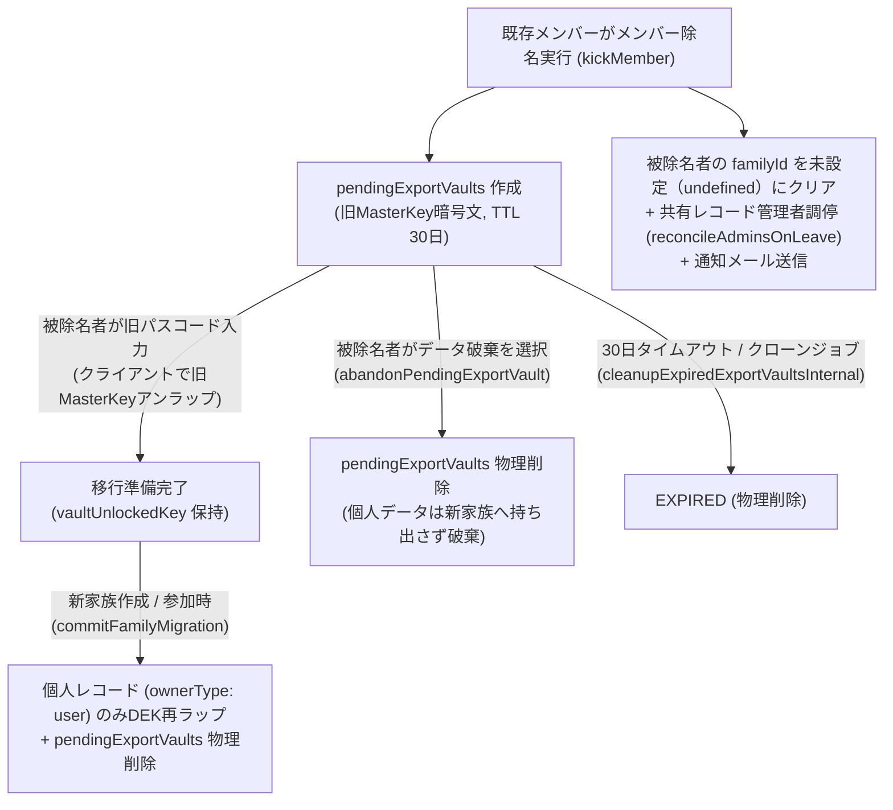
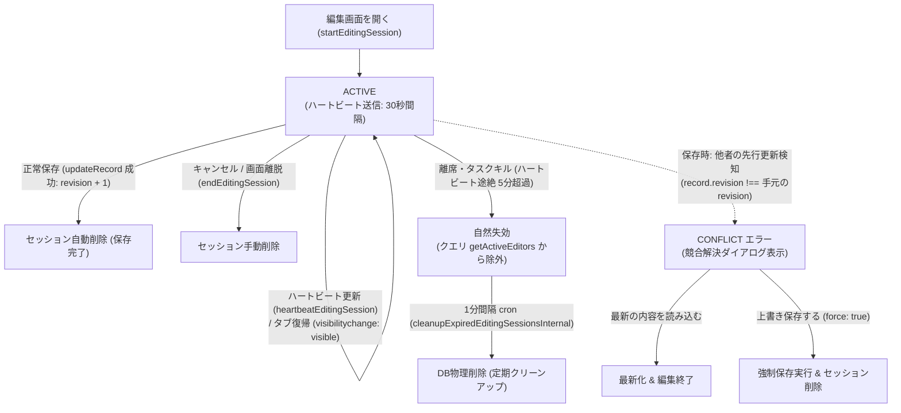

# PoohMa Domain Models & Status Transitions

PoohMa における主要ドメインエンティティの関係性、ライフサイクル、状態遷移ルールを整理する。

---

## 1. エンティティ相関図 (Entity Relationships)

---

## 2. 状態遷移とライフサイクル (State Transitions)

### 2.1 家族招待 (`familyInvites`) と参加申請 (`joinRequests`) のライフサイクル

- **招待コード発行**: 既存家族メンバーが有効期限（15分〜30日）を指定して発行（`createInviteCode`）。いつでも手動失効（`revokeInviteCode`）可能。
- **参加申請トリガー**: 申請者が有効な招待コード（リンク/QR）を入力して申請を作成（`createJoinRequestWithInvite`）。
- **承認時**: 既存家族メンバーのいずれかが承認（`approveJoinRequest`）すると、対象アカウントの `user.familyId` が更新され、申請者に通知。
- **拒否・取り下げ時**: 既存メンバーによる拒否（`rejectJoinRequest`）または申請者自身によるキャンセル（`cancelJoinRequest`）により `rejected` となり、家族へのアクセス権は付与されない。
- **参加完了後**: 申請者は家族パスコードを入力してマスターキーをロック解除し、家族内での利用を開始する。

---

### 2.2 家族移行トランザクション (`familyMigrations`)

- **ステータス**:
  - `PREPARED`: 移行準備完了。移行対象のレコード一覧とスナップショットを保持。
  - `COMPLETED`: 再暗号化データの保存と `familyId` の付け替えが正常完了。
  - `EXPIRED`: 30 分以内に完了せず失効（Crons による定期クリーンアップ対象）。
  - `ABORTED`: ユーザーによる手動中断。

---

### 2.3 リカバリー 2 段階復元 (`recoveryOtps` / `recoverySessions`)

---

### 2.4 メンバーキックと Export Vault (`pendingExportVaults`) のライフサイクル

- **キック実行**: 家族メンバーが他メンバーを除名（`kickMember`）。自己キックや別アカウントの指定は拒否。
- **データ分離**: 共有レコード（`ownerType: "family"`）は旧家族資産として残り、被キックユーザーの `familyId` を即時クリア。管理者であった場合は `reconcileAdminsOnLeave` で残存メンバーへ調停。
- **Export Vault 退避**: 個人レコード（`ownerType: "user"`）の持ち出しを可能にするため、旧家族の `masterKeyEncrypted`, `masterKeyIv`, `masterKeySalt`, `kdfIterations`, `cryptoVersion` を `pendingExportVaults` へ原子的に退避。
- **持ち出し完了または破棄**: 被キックユーザーが旧パスコードでアンラップして新家族へ持ち出し完了（`commitFamilyMigration`）するか、手動破棄（`abandonPendingExportVault`）、または 30日経過による自動クリーンアップ（1時間ごとの Cron）によって Vault は物理削除される。

---

### 2.5 レコード同時編集セッションと排他制御 (`recordEditingSessions` / FR-REC-15)

- **プレゼンス（Soft Advisory）**: 編集セッションは他者の編集を一切ブロックせず、注意喚起のみを行う。誰かが開きっぱなしで放置しても家族が編集不能になるデッドロックを防止。放置された期限切れセッションは1分cronで物理削除される。
- **データ保全（Hard Invariant）**: 最終防衛線として `revision`（単調増加整数）の楽観的ロック検証により、無警告の先行データ上書きを確実に遮断。

---

## 3. レコード所有権モデルとアクセス権マトリクス

| 操作 | 個人レコード (`ownerType: "user"`) | 共有レコード (`ownerType: "family"`) |
| --- | --- | --- |
| **閲覧・復号** | 所有アカウント (`accountId === user._id`) のみ | 同一 Family に所属する PoohMa Account 全員 |
| **編集 (タイトル/メモ/タグ等)** | 所有アカウントのみ | 同一 Family に所属する PoohMa Account 全員 |
| **ヒント更新 (DEK再暗号化)** | 所有アカウントのみ | 同一 Family に所属する PoohMa Account 全員 (家族マスターキーでDEK再ラップ) |
| **共有解除 (個人へ戻す)** | 対象外 | レコード管理者 (`admins.includes(user._id)`) のみ |
| **管理者変更 (admins追加/削除)** | 対象外 | レコード管理者のみ |
| **削除** | 所有アカウントのみ | レコード管理者のみ |

---

## 4. データ整合性・カスケード削除ルール

- **レコード削除時**:
  - 親レコード（`serviceRecords`）削除時、または一括削除（`deleteRecords`）時、紐づくすべての `credentials` が `deleteCredentialsForRecord` ヘルパーによりカスケード削除される。
- **ユーザー退会時**:
  - 家族に残存メンバーがいる場合、退会者の個人レコード（`ownerType: "user"`）およびその配下の `credentials` のみを削除する。共有レコード（`ownerType: "family"`）は元の家族に残し、`reconcileAdminsOnLeave` により残存メンバーへ管理権限を調整する。
  - 退会者が家族グループの最後の 1 人である場合、その家族に紐づく全 `serviceRecords`、配下の全 `credentials`、参加申請（`joinRequests`）、招待（`familyInvites`）、および `families` レコードを削除する。
- **家族離脱時**:
  - 家族移行トランザクションの対象となる個人レコード（`ownerType: "user"`）とその `credentials` は、新マスターキーで再暗号化されて移行先へ引き継がれる。
  - 共有レコード（`ownerType: "family"`）は元の家族グループに残留する。離脱者がレコード管理者である場合、`reconcileAdminsOnLeave` が残存する家族メンバーの管理権限を調整する。
- **メンバーキック時**:
  - 被キックユーザーの個人レコード（`ownerType: "user"`）は削除されず、旧家族の暗号化マスターキー情報が `pendingExportVaults`（30日TTL）に退避され、新家族への移行（再暗号化）に備える。
  - 共有レコード（`ownerType: "family"`）は元の家族グループに残留し、被キックユーザーがレコード管理者である場合は `reconcileAdminsOnLeave` が残存メンバーの管理権限を自動調停する。
  - 移行完了時（`commitFamilyMigration`）またはユーザーによる手動破棄（`abandonPendingExportVault`）時に、`pendingExportVaults` は物理削除される。
- **同一 email アカウント再作成時のデータ引き継ぎ（`users.syncUser`）**:
  - メールアドレス未確認（`emailVerified: false`）の場合はエラーを送出して同期を拒否する。
  - 同一 email かつ別 UID の既存データが存在する場合、旧 UID の `serviceRecords.userId`、家族参加申請（`joinRequests`）、および家族移行データ（`familyMigrations`）を新 UID へ一括付け替えて引き継ぐ（所有権を示す `serviceRecords.accountId` は維持される）。

---

## 5. レコード制約・バリデーション境界 (Constraints & Limits)

巨大ドキュメント生成防止およびUI・DB・CSVインポート間の整合性担保のため、以下の制約を設けている。

- **認証情報項目数 (`credentials`)**: 最大 10 件 (`MAX_CREDENTIALS_PER_RECORD = 10`)
  - UI追加制御、Zodスキーマ、Convexミューテーション、CSVエクスポート・インポートの列定義（1〜10）で統一。
- **タグ数 (`tags`)**: 最大 20 個 (`MAX_TAGS_PER_RECORD = 20`)
  - UI入力制御、Zodスキーマ、Convex一括更新（`bulkUpdateRecords`）、CSVインポートで統一。
- **文字数上限**:
  - タイトル (`title`): 最大 255 文字（必須）
  - 読み仮名 (`titleReading`): 最大 255 文字
  - メモ (`memo`): 最大 10,000 文字
  - パスワードヒント平文: 最大 2,000 文字
  - 各タグ文字列: 最大 50 文字

---

## 6. お問い合わせ (`contacts`) エンティティ

`contacts` テーブルはユーザーからのお問い合わせを格納する単純な書き込み専用テーブル。アクセス制御は不要（認証不要で送信可能）で、読み取りは管理者運用のみを想定。

| フィールド | 型 | 説明 |
| --- | --- | --- |
| `name` | string | 送信者名 |
| `email` | string | 送信者メールアドレス |
| `category` | string | お問い合わせ種別 |
| `message` | string | 本文（最大3000文字） |
| `userId` | string? | Firebase UID（ログイン中の場合のみ） |
| `createdAt` | number | 送信日時（Unix ms） |
| `status` | `UNREAD`\|`READ`\|`RESOLVED` | 管理ステータス（初期値: `UNREAD`） |

- **スパム・乱用対策**:
  - **Honeypot**: 非表示フィールド（`hpConfirm`）による単純ボット排除
  - **グローバル/バースト制限**: Convex公式 `@convex-dev/rate-limiter` によるトークンバケット制限（1分間に最大5件回復、キャパシティ10件）
  - **同一メール短時間連投制限**: `by_email_createdAt` インデックスにより直近10分間で3件以上の同一メール送信をブロック
  - **入力バリデーション**: 厳格な型検証（お名前1〜100文字、メールRFC準拠、メッセージ5〜3000文字）
- **メール通知**: `createContact` 成功後、`ctx.scheduler.runAfter(0, ...)` で `sendNotificationEmail` internalAction を非同期実行。`ADMIN_EMAIL`（フォールバック: `RESEND_MAIL_FROM`）宛てに `ContactNotificationEmail` テンプレートで通知。`replyTo` に問い合わせ者メールを設定。
- **インデックス**: `by_createdAt`（管理一覧ソート用）、`by_email_createdAt`（メール別短時間レート制限用）

---

## 7. お知らせ (`NewsContent`) - microCMS `info` エンドポイント

お知らせはConvexではなくmicroCMSで管理。`NewsContent` 型（`cms.server.ts`）と同義の `InfoContent` エイリアスも提供。

| フィールド | 型 | 説明 |
| --- | --- | --- |
| `id` | string | microCMS コンテンツID |
| `slug` | string | URLスラッグ |
| `title` | string | お知らせタイトル |
| `content` | string | リッチテキスト（HTML文字列） |
| `published_at` | string? | カスタム公開日時フィールド |
| `thumbnail` | `{url, width, height}`? | サムネイル画像 |
| `publishedAt` | string | microCMS標準公開日時（MicroCMSBase） |

- **取得関数**: `fetchNewsListServer`（`info` エンドポイント、最大20件、`-publishedAt,-createdAt` 順）/ `fetchNewsDetailServer`（IDで1件取得）
- **キャッシュ**: `staleTime = 5分`（NEWS_STALE_TIME）
- **表示**: ヘッダーベル（`NewsBell` + Popover、未読バッジ付き）/ ユーザーメニュー / `/news` 一覧・`/news/$id` 詳細ページ（公開ルート）
- **未読管理**: localStorage の `poohma_last_read_news_time`（Unix ms）と最新記事の `published_at` を比較。ベル開封時に更新。

---

## 8. 監査ログ (`auditLogs`) エンティティ

`auditLogs` テーブルは、レコードの全操作（作成・更新・削除・ヒント閲覧・共有設定変更・管理者変更）を家族単位で時系列記録する書き込み専用テーブル。

### 記録トリガー・操作種別

| action | トリガー | familyId | targetAccountId |
| --- | --- | --- | --- |
| `RECORD_CREATE` | `createRecord` | ownerType=familyのとき | ownerType=userのとき |
| `RECORD_UPDATE` | `updateRecord` | ownerType=familyのとき | ownerType=userのとき |
| `RECORD_DELETE` | `deleteRecord` / `deleteRecords` | ownerType=familyのとき | ownerType=userのとき |
| `HINT_VIEW` | `logRecordHintView` | ownerType=familyのとき | ownerType=userのとき |
| `SHARE_SETTING_CHANGED` | `shareRecord` / `unshareRecord` | 常にfamilyIdあり | - |
| `ADMIN_CHANGED` | `addRecordAdmin` / `removeRecordAdmin` | 常にfamilyIdあり | - |

### データ保持・クリーンアップ

- **保持期間**: 180日（`RETENTION_MS = 180 * 24 * 60 * 60 * 1000`）
- **定期削除**: 24時間間隔cron（`cleanupOldAuditLogsInternal`）が `by_createdAt` インデックスで期限切れログを100件ずつバッチ削除。件数上限到達時は `ctx.scheduler.runAfter(0, ...)` で再帰実行。
- **actorDisplayNameの保存**: 脱退・アカウント削除後もログ一覧で権限者を識別できるよう、操作時点の表示名を参照切れに顧慮して保存する。取得時（`getFamilyAuditLogs` / `getRecordAuditLogs`）には DB から最新の `displayName` を上書きして返す。

### UI連携

- **レコード詳細画面** (`routes/(app)/records/$id.tsx`): `RecordAuditHistoryAccordion` コンポーネントが `getRecordAuditLogs`（最大30件）を購読し、アクセス・変更履歴をアコーディオンUIで表示。
- **家族画面** (`routes/(app)/family.tsx`): `FamilyAuditLogSection` コンポーネントが `getFamilyAuditLogs`（ページネーション）を購読し、家族のアクティビティログをアコーディオンUIで表示。
- **ヒント閲覧ログ記録**: `CredentialCard` コンポーネントの暗号復号成功時に `logRecordHintView` Mutationを非同期呼び出し（失敗してもUIに影響しない）。
