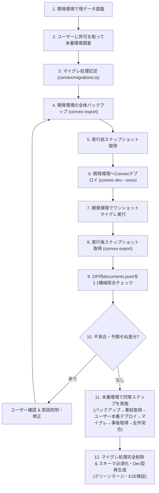

# One-Shot Migration Workflow

Convex におけるデータ移行・スキーマ更新を安全かつ確実に完遂するための公式ワンショットマイグレーション手順です。
旧データに対する不要な後方互換性コードを永続的に残さず、かつデータ欠落や誤更新を未然に防ぐため、必ず本ワークフローの全ステップを順に実行してください。

---

## 1. 原則とルール

1. **手動ワンショット移行と後方互換コードの排除**:
   - アプリケーションコード側（Queries, Mutations, Hooks, UI）に「未移行データを検知して例外スローする」過剰ガードや、古いスキーマの後方互換フォールバックを恒久的に残さない。
   - データ移行は「事前バックフィル（ワンショット実行）」で完結させ、移行完了後はスキーマを必須化し、マイグレーションコード自体はコミット前に削除する。
2. **先行本番マイグレーションによる完全必須化・クリーンマージ原則**:
   - PR に一時マイグレーション関数やオプショナルスキーマ（`v.optional(...)`）を残してマージすると、二段階リリースや不要な管理コスト、マイグレ実行漏れが生じる。
   - トピックブランチ上で先行して本番環境へのバックアップ、デプロイ、マイグレ実行、突合検証を完遂し、直後にマイグレ関数を削除してスキーマを必須型（`v.boolean()` 等）に昇格させる。
   - PR には一時マイグレコードを一切含めず、「必須スキーマ ＋ 新機能ロジック ＋ テスト」のみのクリーンな差分として提出・マージする。
3. **本番環境アクセスの厳格な合意分離と手動デプロイ委任**:
   - 本番環境（Production DB）の調査・マイグレーション・バックアップを行う際は、**必ず事前にユーザーへ許可を取り、明示的な合意を得てから接続・実行する**。
   - 本番環境への Convex デプロイは、非対話シェルでのプロンプト停止（`Do you want to push your code to your prod deployment...?`）を回避し安全性を担保するため、**ユーザーの対話ターミナルで `pnpm convex:deploy` を実行してもらい完了報告を受ける**運用とする。
4. **実施前後のスナップショット突合義務**:
   - 「マイグレーション関数がエラーなく終了した」だけで安心せず、必ず実行前後の対象テーブル全件（`convex export` の ZIP 内 `documents.jsonl` 等）を機械的に 1:1 突合（Diff 検証）し、想定外のフィールド書き換えや欠落がないことを確認する。

---

## 2. ワンショットマイグレーション 標準実行ステップ

以下の全12ステップを順次実行します。開発環境で完全に突合・検証し、ユーザー合意を得てから本番環境へ進むこと。

### Step 1: 開発環境で現データ調査

- 開発環境（Convex dev）の対象テーブルの全レコードを精査する。
- 欠損値（`undefined`, `null`, 空文字等）、想定外の型、旧形式データの件数と傾向を分析する。

### Step 2: ユーザーに許可を取って本番環境調査

- 開発環境での調査結果をユーザーに報告し、本番環境の調査方針を提示する。
- **必ずユーザーの明示的な許可を得てから**、本番環境へ接続して同様のデータ分析を行う。

### Step 3: マイグレ処理記述

- 一時マイグレーションファイル（例: `convex/migrations.ts`）を作成し、ワンショット実行用の mutation（`internalMutation` 等）を実装する。
- バッチ処理・冪等性（既に移行済みのレコードを二重更新しない、または上書きしても安全な設計）を担保する。

### Step 4: 開発環境の全体バックアップを作成

- `pnpm -F @poohma/web exec convex export --path .local/migrations/dev-backup-before.zip` 等で全体バックアップを取得する。
- **注意**: `pnpm -F @poohma/web exec` では Cwd が `apps/web` となるため、パスに `apps/web/` を含めると二重ディレクトリ（ENOENT）になる。必ずパッケージ相対パス（`.local/...`）を指定する。

### Step 5: 開発環境の対象テーブルを JSON で取得（実行前）

- Step 4 のエクスポート ZIP 内にある `[table]/documents.jsonl` を展開するか、または Convex CLI 経由で実行前スナップショットを取得・保存する。

### Step 6: 開発環境で Convex のデプロイ

- `pnpm convex:dev:once`（または `pnpm -F @poohma/web exec convex dev --once`）を実行し、マイグレーション関数を開発環境へ反映する。

### Step 7: 開発環境でワンショットマイグレ実行

- Convex CLI (`npx convex run migrations:xxx`) 等でマイグレーションを実行する。
- 実行ログ、更新件数、実行時間を記録する。

### Step 8: 開発環境で実施後の対象テーブル取得（実行後）

- 再度 `convex export` を実行し、実行後スナップショット ZIP（例: `dev-backup-after.zip`）を取得する。

### Step 9: 実施前後のデータを突合してチェック

- 突合検証スクリプトを作成・実行し、実行前後の ZIP 内 `documents.jsonl` を 1 レコードずつ突合する。
- **検証ポイント**:
  - 総件数が完全に一致しているか（レコードの消失や二重作成がないか）。
  - 対象フィールドのみが意図したルール通りに更新されているか。
  - 対象外のフィールド（ID、作成日時、暗号化データ等）が一切改変・欠落していないか。
  - 欠損件数が完全に 0 件になっているか。

### Step 10: （不具合あればユーザーに確認）→ 問題解消後

- 予期しない差分や不整合が 1 件でも検知された場合は、作業を中断してユーザーへ報告する。
- 原因を究明してマイグレ処理を修正し、Step 4〜9 を再実行して安全を確認する。

### Step 11: 本番環境のマイグレ処理を開発環境と同じステップで実施

- 開発環境での完全合格をユーザーに報告し、本番適用の合意を得る。
- **本番環境でも開発環境と全く同じステップ**を順に実行する：
  1. 移行前後の突合検証で不要な差分混入を防ぐため、対象テーブルへの通常書き込みを行わない（事後バックアップ完了まで維持する）
  2. 本番環境の全体バックアップ作成（`pnpm -F @poohma/web exec convex export --prod --path .local/migrations/prod-backup-before.zip`）
  3. ユーザーに対話ターミナルで `pnpm convex:deploy` の実行を依頼（非対話環境でのプロンプト停止を回避）
  4. 本番環境でワンショットマイグレ実行（`pnpm -F @poohma/web exec convex run --prod migrations:xxx`）
  5. 本番環境の事後バックアップ作成（`pnpm -F @poohma/web exec convex export --prod --path .local/migrations/prod-backup-after.zip`）
  6. 実施前後のデータ機械突合チェック（全件検証・暗号化含む他フィールドの無改変・欠損 0 件の確認）
  7. ユーザーへの完了報告

### Step 12: マイグレ処理削除とスキーマ・ビジネスロジックの整理

- **マイグレ処理ファイルの完全消去**:
  - 一時マイグレーションファイル（例: `convex/migrations.ts`）や一時スクリプトを削除する（リポジトリ・本番に残さない）。
- **スキーマの必須化（後方互換性の排除）**:
  - `packages/backend/convex/schema.ts` で対象フィールドの `v.optional()` を解除し、必須型にする。
  - `pnpm convex:dev:once` で型定義（`dataModel.d.ts`）を再生成する。
- **ビジネスロジックの整理**:
  - 対象フィールドを扱う Mutations, Queries, UI から、旧データ補完コード（`record.field ?? fallback` や `if (!record.field)`）を削除し、必須前提のシンプルなコードへ刷新する。
- **品質検証**:
  - `pnpm typecheck`, `pnpm check`, `pnpm test`, `pnpm test:e2e` を実行し、全件合格を確認する。

