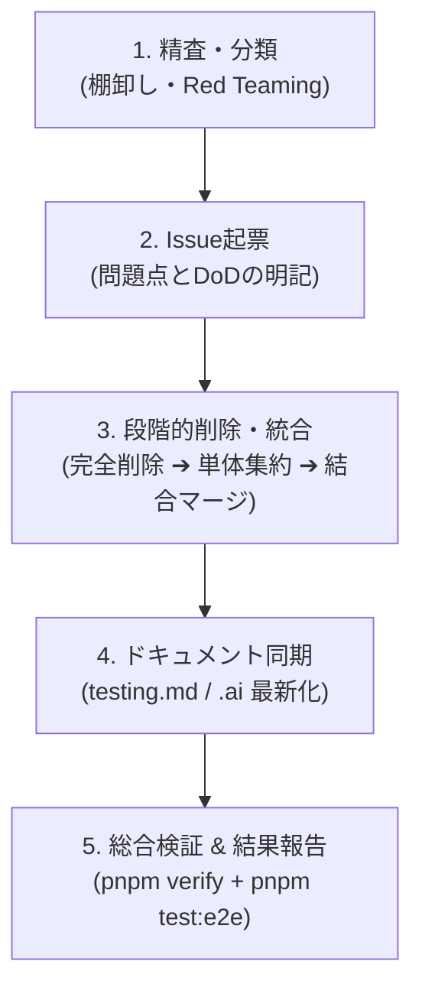

# Test Suite Pruning & Refactoring Workflow

PoohMa におけるテストスイート最適化（不要テストの削除・重複テストの統合・スリム化）の標準手順と判断基準を定義する。

---

## 1. 目的と判断原則

テストスイートの肥大化は、CI実行時間の悪化、モック変更に伴う保守コスト増大、テストの不安定化（Flaky）を招く。
テストリファクタリング時は、「テスト件数やカバレッジ数値の維持」自体を目的にせず、以下の原則に基づいて精査する。

### 判断基準: 「削除すると、どんな現実的な不具合を見逃すか」

- **「念のため」の完全排除**: 「念のため残しておく」は負債の温床。実行時間・不安定さ・修正負担と、そのテストが与える保証価値を天秤にかける。
- **絶対防衛ライン（不変条件）**:
  - E2EE 暗号境界（Zero-Knowledge 保証、平文ヒント非露出）
  - 認可・アクセス制御境界（IDOR防止、家族境界、所有権モデル）
  - セキュリティパラメータの配線（KDF反復回数 `kdfIterations: 500_000`、誤入力ロックアウト指数バックオフ）
  - 実ブラウザ / 外部API連携（WebAuthn PRF、Playwright E2E 貫通検証）

### 削減・統合の対象パターン

1. **実装のコピー / モックの自己検証**: ライブラリの関数（Firebase Auth, Google Picker 等）を手動モックし、そのモックが呼ばれたかをスパイ・検証するだけのテスト。
2. **型システム・ライブラリの保証の再確認**: TypeScript の型チェックや Zod / Convex Schema が弾く自明な型違反（NaN, Infinity, 小数、基本必須チェックなど）をバックエンド結合環境で反復するテスト。
3. **他テスト層との重複**: 下位層（単体・JSDOM）と上位層（Storybook, 結合テスト, Playwright E2E）で同一の正常系UIや画面遷移を重複検証しているテスト。
4. **内部実装への過度な依存**: プライベートヘルパー関数や内部実装の詳細を個別にテストしているもの（公開関数のテストに集約可能）。
5. **過剰なケース分け**: 個別の `it` ブロックで冗長に記述されている長さ・境界値テスト（`it.each` テーブルテストに凝縮可能）。

---

## 2. テストリファクタリングの標準フロー（5フェーズ）

### フェーズ 1: 全テスト精査と批判的レビュー（Red Teaming）

1. 全テストファイルをリストアップし、「完全削除」「統合・スリム化」「不変条件として保持」に分類する。
2. **批判的レビュー（自己反論）**: 「安易に削ると設定値の配線漏れやリグレッションを見落とさないか」を精査し、過剰な削除計画を是正する。
3. GitHub Issue を起票し、問題点と完了基準（DoD）を明確にする。

### フェーズ 2: 完全不要テストの削除 & E2E集約

1. 上位層（Playwright E2E や Storybook）で完全に代替可能な JSDOM 画面テストや重複 E2E ファイルを削除。
2. 画面遷移テストやヘッダー・見出し存在確認（H1）は、既存のダッシュボード画面往復テスト（`dashboard.spec.ts`）等へ 1 アサーションとして統合。
3. `git rm` でファイルを削除し、ルートから `pnpm check; pnpm typecheck` で構文・参照エラーがないことを確認。

### フェーズ 3: 単体・ユーティリティテストのテーブル集約

1. **境界値テストの集約**: 多数の `it` に分散した文字数・件数制限テストを、1つの `it.each([...])` テーブルテストに凝縮。
2. **重複スキーマテストの削除**: 親スキーマ内で包括検証されている子スキーマ単体テストを削除。
3. **下位ヘルパーテストの集約**: 内部のプライベート/下位ヘルパーのテストを削除し、公開上位関数（例: `filterAndGroupFaqs`）のテストに統合。
4. **外部通信の排除**: 外部（例: `example.com`）への実リクエストや過剰なIPアドレス反復を削除。

### フェーズ 4: バックエンド結合テストの統合・RLS一本化

1. **重複テストスイートのマージ**: 類似した結合テストファイル（例: `convex-rls.spec.ts` と `convex-records.spec.ts`）が存在する場合、固有の認可テスト（権限拒否、家族境界、一括削除ガード等）をメインファイルへ移植して一本化する。
2. **Zod / Schema 再確認テストの削除**: 単体テスト層（`schemas.test.ts`）で検証済みのバリデーション違反テストを結合テスト層から削除。
3. 各ステップごとに `pnpm check`, `pnpm typecheck`, `pnpm test` を実行して合格を確認。

### フェーズ 5: ドキュメント同期・総合検証・結果報告

1. **ドキュメント同期（Doc-Sync）**: `.ai/testing.md` および `.docs/testing.md` のファイル構成、テスト総数、カバレッジ実績値を最新化。
2. **総合品質パイプライン**:
   - `pnpm check` & `pnpm typecheck`
   - `pnpm test`（個別ファイル 80% カバレッジ基準の維持確認）
   - `pnpm build`
   - `pnpm test:e2e`（ローカル動的検証の完走）
3. **結果報告（コミット前）**:
   - コミット前に必ずユーザーへ削減ファイル数、削減行数、実行速度短縮、カバレッジ維持状況、変更ファイル一覧を報告し合意を得る。

---

## 3. ガードレール & コマンド実行の原則

- **ルートからのシンプルな実行**:
  Turborepo 構成のため、個別のパッケージディレクトリへ移動（`cd`）せず、常にリポジトリルートから `pnpm <command>` で実行する（不要なシェル操作やトークンの浪費を防ぐ）。
- **テストを通すためのプロダクションコード改変の完全禁止**:
  テストリファクタリング中にテストが失敗した場合、テストコード側のセレクタや前提データを見直すこと。プロダクションコードを独断で改変してはならない（GEMINI.md 第0節）。
- **ローカル動的検証（`pnpm test:e2e`）の義務**:
  E2E や結合テストに手を入れた際は、静的チェックのみで済ませず、必ず `pnpm test:e2e` を合格させてからコミットする。
- **UTF-8 一時ファイルを経由したコミット**:
  Windows PowerShell 環境における文字化け・エスケープ破壊防止のため、コミットメッセージは必ず UTF-8 一時ファイルを経由する（`.ai/workflows/git-workflow.md` 参照）。
