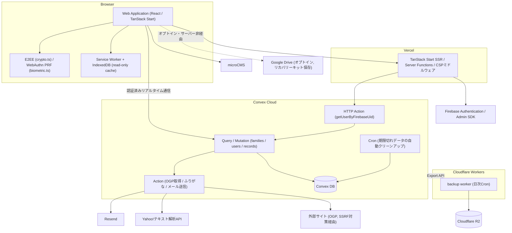

# Architecture Overview

## 概要

PoohMa は、家族間でアカウント情報を共有・管理するための Web アプリケーションである。実際のパスワードは保存せず、家族だけがわかる「パスワードのヒント」をブラウザ側で暗号化してから保存する。サービス名・URL・メモ・タグ・ログインID等のメタデータは暗号化せず平文で保存する（暗号化対象を最小化し、実装・運用のリスクを絞る設計判断。Issue #2「平文をサーバサイドで扱ってないかチェック」でこの境界が確認されている）。

本ドキュメントはコンポーネント構成とデータフローの全体像を示す。鍵管理の詳細は [E2EE Design](./security/e2ee.md)、想定脅威は [Threat Model](./security/threat-model.md) を参照。

## コンポーネント構成

### Web Application

- React 19 + TanStack Start（SSR）+ TanStack Router + TanStack Query。Vercel にデプロイ。
- Server Functions（`syncUser` / `getAuthUser` / `logout` 等）が Firebase Admin SDK による ID トークン検証・セッション Cookie 発行を担当する。
- `ConvexReactClient` を `ConvexProviderWithAuth` でラップし、`useConvexFirebaseAuth` が Firebase の ID トークンを Convex 認証に供給する。
- 暗号化・復号（`src/lib/crypto.ts`）と生体認証（`src/lib/biometric.ts`, WebAuthn PRF拡張）はすべてクライアント側で完結する。
- Service Worker + IndexedDB による読み取り専用のオフラインキャッシュ（PWA）を持つ。書き込み系操作（新規登録・編集等）はオフライン中は無効化される。
- サーバーミドルウェア（`start.ts`）が全GETリクエストに対して、nonceベースの厳格なCSPを含むセキュリティヘッダーを付与する（詳細は [Security Model](./security/security-model.md)）。

### Backend（Convex Cloud）

- サーバーレス関数群とリアクティブ DB を提供する BaaS（Issue #53「データ層をPrisma+SupabaseからConvexへ移行」により現行アーキテクチャへ移行済み）。
- Query / Mutation（`families.ts` / `users.ts` / `records.ts`）、Action（`actions.ts`: OGP取得・ふりがな取得・メール送信、Node runtime）、HTTP Action（`http.ts`: `getUserByFirebaseUid`、内部シークレットヘッダーで保護）、Cron（`crons.ts`: 期限切れ家族移行・招待コードの定期クリーンアップ）で構成される。
- 認可は `customBuilders.ts` の3段階のビルダー（`identityVerifiedQuery/Mutation` / `authenticatedQuery/Mutation` / `familyBoundQuery/Mutation`）を必ず経由する設計とし、生の `query` / `mutation` を直接エクスポートしない運用ルールを敷いている。
- レコード単位のアクセス制御（`rls.ts`: `requireContentAccess` / `requireAdminAccess`）で、個人レコードと家族共有レコードの境界、共有レコードの管理者権限を強制する。
- サーバーはパスワードヒントと鍵材料を暗号化済みのまま保存・配信し、復号は行わない。一方、`title`・`url`・`memo`・`tags`・`loginId` は平文メタデータとして保存・配信する。

### Workers

- `workers/backup`（Cloudflare Workers）は、Convex Export API から日次でデータをストリーム取得し Cloudflare R2 へ保存する定期バックアップ専用の Worker（Issue #228「Convex データを Cloudflare Workers + R2 で定時自動バックアップする環境構築」、closed）。
- HTTP の `fetch` ハンドラーを持たず Cron 実行のみに限定し、不要な外部エンドポイントを公開しない設計とすることで攻撃面を減らしている。
- R2 側のライフサイクルルールにより 90 日経過したバックアップを自動削除する。

### Database

- Convex 自身が提供するリアクティブ DB を利用（別建ての DBMS は持たない）。
- 主要テーブル：`families`（暗号化済み鍵材料を保持）、`users`、`serviceRecords`（クレデンシャル本体）、`familyInvites`、`joinRequests`、`familyMigrations`、`recoveryOtps` / `recoverySessions`（リカバリー用）、`loginEvents`。
- 詳細なフィールド構成は [Data Model](./architecture/data-model.md) を参照。

### Authentication

- Firebase Authentication（Google OAuth）でログインし、`auth.config.ts` の Issuer 設定（`securetoken.google.com/poohma`）により Convex 側が Firebase ID トークンをそのまま信頼・検証する。
- サーバー側は Firebase Admin SDK でセッション Cookie（14日間・httpOnly・本番では secure・SameSite=Lax）を発行し、`__root.tsx` の `beforeLoad` が毎回 `checkRevoked: true` 付きで検証する。
- ログアウト時は `revokeRefreshTokens` によるリフレッシュトークンの即時失効と Cookie 削除を行う。

### E2EE

- クライアント側で完結する鍵管理・暗号化の仕組み（PBKDF2 によるパスコード導出鍵、AES-GCM のマスターキー／DEKによるエンベロープ暗号化）。詳細は [E2EE Design](./security/e2ee.md) を参照。
- サーバーが平文のパスワードヒントを一切受け取らないことがアーキテクチャ上の前提であり、DB侵害時の残存リスクとして「メタデータは平文のまま漏洩しうる」ことを [Threat Model](./security/threat-model.md) で明示している。

### External Services

- **Firebase Authentication / Admin SDK**：ログイン、ID トークン発行・検証。
- **microCMS**：FAQ・利用規約・プライバシーポリシーのコンテンツ管理。
- **Resend + React Email**：家族招待・パスコード変更・リカバリー発行等の通知メール送信。
- **Yahoo!テキスト解析API**：サービス名からのふりがな自動生成。
- **任意の外部サイト（OGP取得）**：`src/utils/url-safety.ts` によるSSRF対策（プライベートIP拒否、DNS解決後の再検証、TCP接続時のDNS Rebinding対策、レスポンスサイズ・タイムアウト上限）を経由してのみアクセスする。
- **Cloudflare R2**：Convex データの日次バックアップ保存先。
- **Google Identity Services / Google Drive（オプトイン）**：リカバリーキットPDFの保存先の一つとして、ユーザーが任意で選択できる。ブラウザから直接 Google のOAuth同意画面を経由し、`drive.file`スコープ（アプリが作成したファイルのみにアクセス可能で、ユーザーの既存Driveファイルへは一切アクセスしない）でPoohMaのサーバーを経由せずにアップロードする。利用しない場合はローカル保存・印刷のみで完結し、この連携自体は必須ではない。

## アーキテクチャ図

## データフロー概要

- **クレデンシャル登録**：クライアントで OGP・ふりがなを自動取得後、パスワードヒントのみを `crypto.ts` でクライアント側暗号化し、暗号化済みデータと平文メタデータ（`title`・`url`・`memo`・`tags`・`loginId`）をまとめて `records.createRecord` に送信する。サーバーは平文のパスワードヒントを受け取らない。
- **ログイン**：Firebase でのログイン後、ID トークンをサーバー関数 `syncUser` に渡し、Convex 側にユーザー情報を同期。以後はセッション Cookie とリアルタイムな Convex 接続で認証状態を維持する。
- **家族共有**：招待コード（TTL付き）経由の参加申請＋既存メンバーの承認という二段階フローを経て家族に参加する。共有データの復号に必要なマスターキーは、パスコードを知っているメンバーの端末上でのみ展開される。
- **バックアップ**：アプリケーションの通常のリクエスト経路とは独立して、Cloudflare Workers が日次で Convex Export API から、暗号化済みのパスワードヒント・鍵材料と平文メタデータ（`title`・`url`・`memo`・`tags`・`loginId`）を含む Convex データ全体を取得し R2 に保存する。
- **リカバリーキットの保存（任意）**：ユーザーがGoogle Driveへの保存を選んだ場合のみ、ブラウザから直接Googleへアップロードする。PoohMaのサーバーはこの経路に一切関与しない。

## 今後の変更予定

- Web Application のホスティングを Vercel から Cloudflare Workers / Pages へ移管する計画があり（Issue #218「Cloudflare Workers / Pagesへのアプリケーション移管」, #219「Cloudflare移行に伴う外部サービス・Runtime互換性対応」、いずれも open）、実現した場合は本ドキュメントの「Web Application」節・アーキテクチャ図の見直しが必要になる。
- `credentials` の独立テーブル分離（Issue #139, open）が実現した場合、Database節・データモデルの見直しが必要になる。

## 関連ドキュメント

- [E2EE Design](./security/e2ee.md)
- [Threat Model](./security/threat-model.md)
- [Security Model](./security/security-model.md)
- [Data Model](./architecture/data-model.md)
