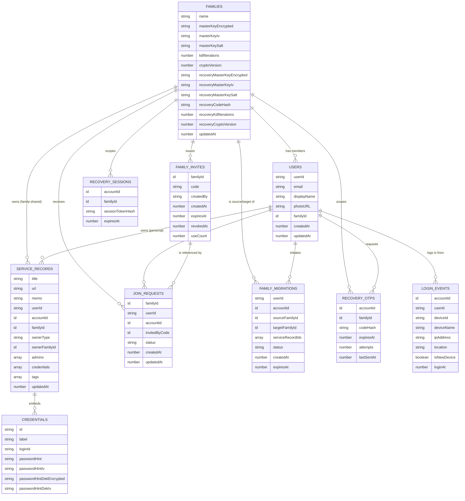

# Data Model

## 概要

`apps/web/convex/schema.ts` に定義された Convex スキーマをもとに、主要エンティティとリレーションを整理したものである。Convex はスキーマレスに近い柔軟な構造を許容するが、本書は現行の `schema.ts` の定義に忠実に記載する。

## ER Diagram

## エンティティ補足

### FAMILIES
- 家族グループ単位のレコードで、E2EEの鍵材料（マスターキー・リカバリーマスターキーの暗号化済み値、ソルト、反復回数、暗号化スキームバージョン）を保持する。
- `kdfIterations` / `cryptoVersion` をレコード単位で保持することで、将来 PBKDF2 の反復回数を引き上げた場合でも、旧パラメータで作成された既存データを後方互換的に復号できる。

### USERS
- Firebase UID（`userId`）に紐づくアプリケーション内アカウント。`familyId` は単一値であり、現行スキーマは「1ユーザー1家族グループ」を前提とする（複数家族の並行所属は未対応）。

### SERVICE_RECORDS
- クレデンシャル管理の中心となるエンティティ。`ownerType`（`"user"` | `"family"`）により個人所有か家族共有かを切り替え、`ownerFamilyId` と `admins` は共有時のみ意味を持つ。
- `credentials` は独立したテーブルではなく、`serviceRecords` 内の埋め込み配列（オブジェクト配列）フィールドとして保持される。1レコードあたり最大10件（`MAX_CREDENTIALS_PER_RECORD`）。
- インデックス：`by_userId`, `by_accountId`, `by_family_sortKey`（家族内の並び順取得）, `by_ownerType_accountId`, `by_ownerType_ownerFamilyId`（フルテーブルスキャンを避けた効率的な取得に利用）。

### FAMILY_INVITES / JOIN_REQUESTS
- 招待コード（`familyInvites`）と参加申請（`joinRequests`）は明確に分離されたテーブルであり、招待コード自体は「参加申請を送る権利」のみを表す。実際の参加確定には `joinRequests.status` が `approved` になった上での別操作（`joinFamily`）が必要。

### FAMILY_MIGRATIONS
- 家族グループの乗り換え（同一ユーザーが別の家族グループへ移る操作）を、準備（PREPARED）→確定（COMPLETED）／中断（ABORTED）／失効（EXPIRED）の状態遷移で管理する。
- `serviceRecordIds` に移行対象レコードのスナップショットを保持し、再暗号化のバッチ処理・再開（レジューム）に用いる。

### RECOVERY_OTPS / RECOVERY_SESSIONS
- リカバリー時の2要素目（Email OTP）とその検証後に発行される短命な認可セッションを、それぞれ別テーブルとして分離している。OTPコード・セッショントークンはいずれも平文ではなくハッシュのみ保存する。

### LOGIN_EVENTS
- ログイン通知・新規端末検知のための監査ログ。`isNewDevice` により初回端末からのログインを判定する。

## 関連ドキュメント

- Architecture Overview: `docs/architecture.md`
- E2EE Design: `docs/security/e2ee.md`
