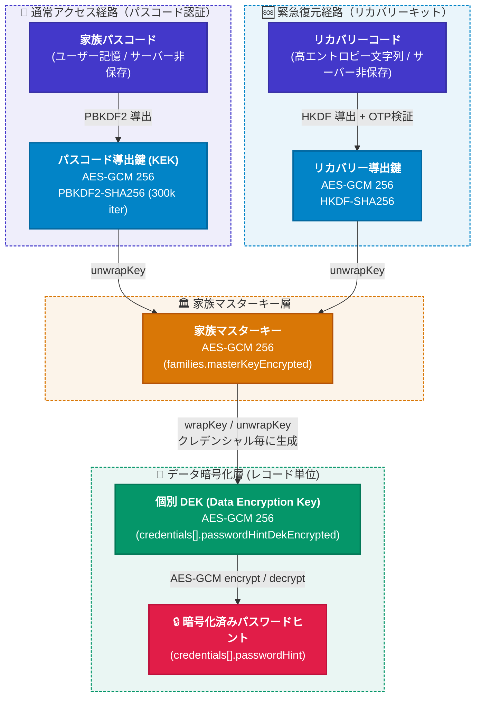
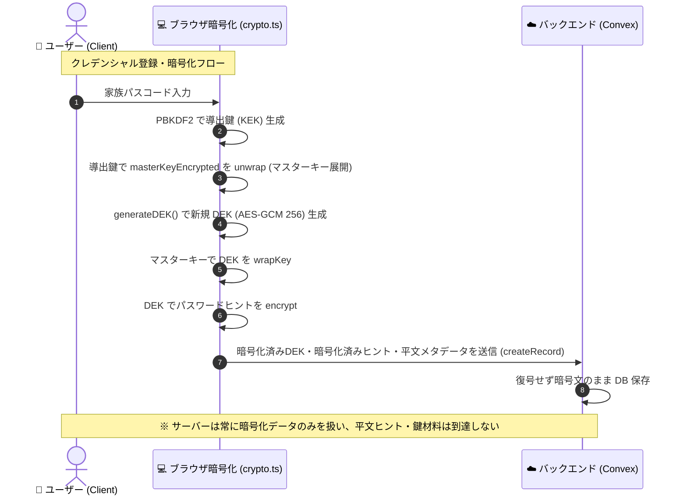

# E2EE Design

## 概要

PoohMa の E2EE は「実際のパスワードではなく、家族だけがわかるパスワードのヒントを守る」ことを目的とする。サービス名・URL・メモ・タグ・ログインID等のメタデータは暗号化対象外であり、これは設計上の意図的な非対象である（詳細は [Threat Model](./threat-model.md) 5章、Issue #2で確認済み）。

鍵管理はエンベロープ暗号化（封筒暗号化）方式で、家族パスコード・マスターキー・DEK（Data Encryption Key）の三層構造を持つ。実装は `apps/web/src/lib/crypto.ts`（Web Crypto API, AES-GCM / PBKDF2）による。

## Key Hierarchy

### 家族パスコード

- 家族メンバーの記憶のみに存在し、サーバー・ブラウザいずれにも保存しない。

### パスコード導出鍵（KEK相当）

- `deriveKeyFromPasscode(passcode, salt)` により PBKDF2-SHA256 で導出する。反復回数は既定 300,000 回で、`families.kdfIterations` としてスキーマ管理し、将来の反復回数引き上げ後も旧パラメータで作成された既存データを復号できるようにしている（Issue #140）。
- この鍵で `families.masterKeyEncrypted` / `masterKeyIv` を unwrap し、マスターキーを得る。

### マスターキー

- 家族グループ共通の AES-GCM 256 鍵。`families.masterKeyEncrypted` / `masterKeyIv` / `masterKeySalt` として保存される（常に暗号化済みの状態のみ）。
- 認証情報（クレデンシャル）を1件登録するたびに `generateDEK()` で新規生成した DEK をこのマスターキーで wrap する。

### DEK（Data Encryption Key）

- 認証情報1件ごとに生成される AES-GCM 256 鍵。`serviceRecords.credentials[].passwordHintDekEncrypted` / `passwordHintDekIv` としてマスターキーでラップされた状態で保存される。
- このDEKでパスワードヒント本体を暗号化し、`credentials[].passwordHint` / `passwordHintIv` として保存する。
- DEK が存在しない旧形式のレコード（移行期のデータ）は、読み取り時のみマスターキーで直接復号する互換パスを持つが、新規の暗号化・再暗号化では常に DEK を必須とする。
- なお `credentials` は現状 `serviceRecords` の埋め込み配列であり、独立テーブルへの分離は計画段階（Issue #139, open）にある。

## Encryption / Decryption Flow

## Key Lifecycle

### Passcode 変更（パスコードのみのローテーション）

- マスターキー自体は変更しない。展開済みのマスターキーを、新しいパスコードから導出した新しい鍵で再 wrap するのみ。
- `families.rotatePasscode` は `masterKeyEncrypted` / `masterKeyIv` / `masterKeySalt` / `kdfIterations` / `cryptoVersion` のみを更新する（Issue #138）。各レコードの DEK・パスワードヒントは一切変更されない（マスターキーが不変のため）。
- Compare-And-Swap により複数端末・複数メンバーからの同時更新の競合を防止する。
- リカバリーキーが発行済みの場合、`recoveryMasterKeyEncrypted` は同一マスターキーへの別経路のラップであるため、このパスコード変更による影響を受けず有効なまま残る。

### Key Rotation（家族移行に伴う再暗号化）

- 家族グループそのものを移る（家族移行）場合はマスターキーが変わるため、DEK の再ラップが必要になる。
- クライアント側で旧マスターキーにより各 DEK を unwrap し、新マスターキーで再 wrap する（パスワードヒント本体は再暗号化不要、DEK の付け替えのみ）。
- 処理はチャンク（バッチ）単位に分割して送信し、各チャンクはレコードの `updatedAt` を前提条件とした楽観的ロックで検証する（Issue #174, #190、いずれもclosed）。
- **未実装の拡張**：処理途中でのタブクローズ等からのより堅牢な中断・再開を目的とした、Web Worker + IndexedDB ベースの専用アーキテクチャ（Issue #111）は、本稿執筆時点で open（計画中）であり、まだ実装されていない。現状はメインスレッド上でのチャンク処理として動作している。

### Recovery

- パスコードとは別に、リカバリーコード（高エントロピーなランダム文字列、サーバー非保存・発行時に一度だけ提示、Issue #134「致命的なデータ喪失を防ぐ『リカバリーキット（復元コード）』の発行」、closed）経由の入口を用意する。
- リカバリーコードから HKDF-SHA256 で導出した鍵で `families.recoveryMasterKeyEncrypted` / `recoveryMasterKeyIv` を unwrap すると、パスコード経路と同一のマスターキーに到達する。
- 復元時はリカバリーコード単体では成立せず、登録メールアドレスへの6桁 Email OTP（SHA-256ハッシュ保存、有効期限10分、最大5回試行、60秒レート制限）の検証が必須の2要素構成になっている。
- 再発行のたびに旧リカバリー暗号情報は完全上書き・破棄され、旧コードは即座に無効化される。

## サーバーが参照可能な情報 / できない情報

| 区分 | 参照可能 | 参照不可 |
| --- | --- | --- |
| パスワードヒント平文 | | 不可（`credentials[].passwordHint` は常に暗号化済み） |
| マスターキー・DEK平文 | | 不可（`masterKeyEncrypted` / `passwordHintDekEncrypted` は常に暗号化済み） |
| 家族パスコード・リカバリーコード | | 不可（サーバーに送信されない） |
| サービス名・URL・メモ・タグ・ログインID | 可（平文保存） | |
| 家族構成（メンバー一覧、招待コードのメタデータ） | 可 | |
| リカバリーコード自体 | | 不可（`recoveryCodeHash` としてハッシュのみ保存） |

## 関連ドキュメント

- [Architecture Overview](../architecture.md)
- [Threat Model](./threat-model.md)
- [Security Model](./security-model.md)
- [Security Policy](../../SECURITY.md)

