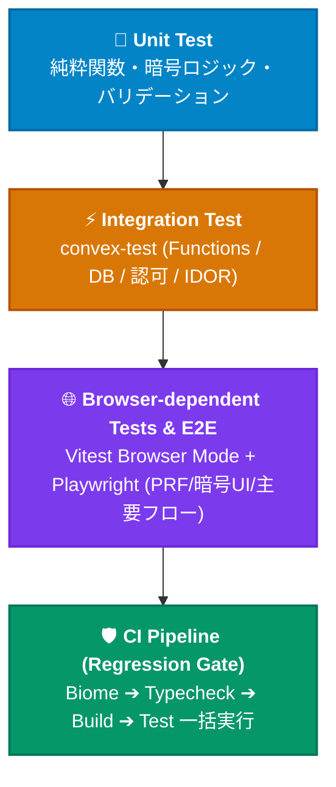

# Test Strategy (テスト戦略と到達状況)

## 1. 目的

PoohMa のテストは、既存テストを基準に場当たり的に拡張するのではなく、現行仕様・設計から必要な振る舞いを定義し、そのすべてを**単体テスト・統合テスト・E2Eテスト**の適切な層で検証する。

特に PoohMa は、単なる CRUD アプリケーションではなく、

- Google 認証・セッション Cookie ローリング
- 家族単位のアクセス制御（Drive型 ACL）
- E2EE（Web Crypto API）によるパスワードヒントの暗号化保護
- 家族パスコードと Master Key / DEK エンベロープ暗号化
- 家族移行（2フェーズトランザクション）と Export Vault 退避
- 招待・参加申請・承認制フロー
- CSV インポート／エクスポート（インジェクション対策）
- OGP 取得と SSRF 防御
- アカウント削除・データカスケード削除

を扱うため、正常系だけでなく、**認可境界・不正入力・状態遷移・データ整合性・暗号境界**を重点的に検証する。

### 現行のテスト実績サマリー (2026年9月現在)

- **Vitest 全体**: **35 テストファイル / 382 テスト全件パス**
- **Convex バックエンド カバレッジ**: **81.42%**（`rls.ts` 100%, `customBuilders.ts` 100%, `users.ts` 97.9%, `recovery.ts` 90.1%, `crypto.ts` 90.6%）
- **Playwright E2E**: 主要公開ルート、認証セットアップ、ログアウト、実暗号化シード復号（`e2ee-seed-import.spec.ts`）を配備

---

## 2. テストレイヤーと責務

| 種別 | 対象 | 主な目的 | 主な採用技術 |
| --- | --- | --- | --- |
| **単体 (Unit)** | 純粋関数、Zod schema、crypto、validation、utility | 個々のロジックが仕様通り動くことを保証 | Vitest |
| **統合 (Integration)** | Convex functions、DB、認可、状態遷移 | サーバー処理とDBを含めた機能・セキュリティ境界を保証 | `convex-test` |
| **ブラウザ依存 / E2E** | ブラウザ上の主要ユーザーフロー、WebAuthn、暗号UI | 認証からUI、実ブラウザAPI（Web Crypto / PRF）を含む利用経路を保証 | Vitest Browser Mode, Playwright |

原則として、同じ仕様をすべてのレイヤーで重複テストしない。

- ロジックの境界値・フォーマット → **単体**
- DB・認可・複数 function の組み合わせ・IDOR → **統合 (`convex-test`)**
- ユーザーが実際に行う一連の操作・実暗号化ラウンドトリップ → **E2E (Playwright)**

---

## 3. 優先度定義

| 優先度 | 定義 |
| --- | --- |
| **P0** | 不具合が発生すると秘密情報漏洩、認証突破、データ消失など重大な影響がある。リリース前必須。 |
| **P1** | 主要機能・主要データに関する回帰を防ぐ。リリース前に原則必須。 |
| **P2** | UI品質、境界的なUX、性能、アクセシビリティなど。継続的に拡充。 |

---

## 4. テストケースマトリクスと現在の到達状況 (Issue #176 追跡)

### 4.1 認証・ユーザー管理

| ID | テストケース | 種別 | 優先度 | 現状 | 主な対応ファイル |
| --- | --- | --- | --- | :---: | --- |
| AUTH-01 | Googleログイン成功 | E2E | P0 | ✅ 実装済 | `e2e/auth.setup.ts` |
| AUTH-02 | Googleログイン後にアプリへ正常遷移 | E2E | P0 | ✅ 実装済 | `e2e/auth.setup.ts` |
| AUTH-03 | 未認証ユーザーの保護ページアクセス拒否 | E2E | P0 | ✅ 実装済 | `e2e/public-routes.spec.ts` |
| AUTH-04 | `syncUser` による新規ユーザー作成 | 統合 | P0 | ✅ 実装済 | `tests/convex-users-auth.spec.ts` |
| AUTH-05 | 既存ユーザーの再同期 | 統合 | P0 | ✅ 実装済 | `tests/convex-users-auth.spec.ts` |
| AUTH-06 | `emailVerified=false` の同期拒否 | 統合 | P0 | ✅ 実装済 | `tests/convex-users-auth.spec.ts` |
| AUTH-07 | 他ユーザーのemailを利用したATO防止 | 統合 | P0 | ✅ 実装済 | `tests/convex-users-auth.spec.ts` |
| AUTH-08 | UID移行時の所有データ整合性・自動引き継ぎ | 統合 | P0 | ✅ 実装済 | `tests/convex-users-auth.spec.ts` |
| AUTH-09 | ログアウト処理 | E2E | P1 | ✅ 実装済 | `e2e/logout.spec.ts` |
| AUTH-10 | ログアウト後の保護ページアクセス拒否 | E2E | P0 | ✅ 実装済 | `e2e/logout.spec.ts` |
| AUTH-11 | アカウント削除（UI上からの退会） | E2E | P0 | ⏳ 未実装 | （統合テスト AUTH-12 で保証） |
| AUTH-12 | アカウント削除によるユーザーデータカスケード削除 | 統合 | P0 | ✅ 実装済 | `tests/convex-users-auth.spec.ts` |
| AUTH-13 | 最後の家族メンバー削除時のFamily自動削除 | 統合 | P0 | ✅ 実装済 | `tests/convex-users-auth.spec.ts` |
| AUTH-14 | 他メンバーがいる場合のFamily保持 | 統合 | P0 | ✅ 実装済 | `tests/convex-users-auth.spec.ts` |
| AUTH-15 | 表示名更新 | 統合 | P1 | ✅ 実装済 | `tests/convex-users-auth.spec.ts` |
| AUTH-16 | 表示名境界値 | 単体 | P1 | ✅ 実装済 | `tests/schemas.test.ts` |
| AUTH-17 | セッション期限切れ・失効時の認証拒否 (`checkRevoked`) | 統合 | P0 | ✅ 実装済 | `tests/firebase-admin.server.spec.ts` |

### 4.2 家族作成・参加・管理

| ID | テストケース | 種別 | 優先度 | 現状 | 主な対応ファイル |
| --- | --- | --- | --- | :---: | --- |
| FAM-01 | 家族作成トランザクション | 統合 | P0 | ✅ 実装済 | `tests/convex-family.spec.ts` |
| FAM-02 | 作成者の `familyId` 設定 | 統合 | P0 | ✅ 実装済 | `tests/convex-family.spec.ts` |
| FAM-03 | 家族名必須バリデーション | 単体 | P1 | ✅ 実装済 | `tests/schemas.test.ts` |
| FAM-04 | 家族名最大長バリデーション | 単体 | P1 | ✅ 実装済 | `tests/schemas.test.ts` |
| FAM-05 | Master Key 情報のバリデーション | 単体 | P0 | ✅ 実装済 | `tests/schemas.test.ts` |
| FAM-06 | 招待コードによる家族情報取得 | 統合 | P1 | ✅ 実装済 | `tests/convex-family.spec.ts` |
| FAM-07 | 不正・期限切れ・失効招待コード拒否 | 統合 | P1 | ✅ 実装済 | `tests/convex-family.spec.ts` |
| FAM-08 | 参加申請作成 | 統合 | P0 | ✅ 実装済 | `tests/convex-family.spec.ts` |
| FAM-09 | 重複 pending 申請拒否 | 統合 | P0 | ✅ 実装済 | `tests/convex-family.spec.ts` |
| FAM-10 | 参加申請一覧取得 | 統合 | P1 | ✅ 実装済 | `tests/convex-family.spec.ts` |
| FAM-11 | 他家族の申請一覧取得拒否（IDOR防止） | 統合 | P0 | ✅ 実装済 | `tests/convex-family.spec.ts` |
| FAM-12 | 参加申請承認 | 統合 | P0 | ✅ 実装済 | `tests/convex-family.spec.ts` |
| FAM-13 | 参加申請却下 | 統合 | P0 | ✅ 実装済 | `tests/convex-family.spec.ts` |
| FAM-14 | 却下申請の削除 | 統合 | P1 | ✅ 実装済 | `tests/convex-family.spec.ts` |
| FAM-15 | 却下後の再申請 | 統合 | P1 | ✅ 実装済 | `tests/convex-family.spec.ts` |
| FAM-16 | 未承認状態で Master Key 取得拒否 | 統合 | P0 | ✅ 実装済 | `tests/convex-family.spec.ts` |
| FAM-17 | 承認後の Master Key 取得 | 統合 | P0 | ✅ 実装済 | `tests/convex-family.spec.ts` |
| FAM-18 | 家族メンバー一覧取得 | 統合 | P1 | ✅ 実装済 | `tests/convex-family.spec.ts` |
| FAM-19 | 他家族のメンバー一覧取得拒否 | 統合 | P0 | ✅ 実装済 | `tests/convex-family.spec.ts` |
| FAM-20 | 家族メンバー削除（キック・自己除名防止） | 統合 | P0 | ✅ 実装済 | `tests/convex-family.spec.ts` |
| FAM-21 | 削除メンバーの `familyId` 即時解除・Export Vault 退避 | 統合 | P0 | ✅ 実装済 | `tests/convex-family.spec.ts` |
| FAM-22 | 削除後の旧家族データアクセス拒否 | E2E | P0 | ⏳ 未実装 | （統合テスト FAM-21 で保証） |
| FAM-23 | 家族未所属ユーザーのアクセス制御（リダイレクト） | E2E | P0 | ✅ 実装済 | `e2e/public-routes.spec.ts` |

### 4.3 家族移行 (Family Migration)

| ID | テストケース | 種別 | 優先度 | 現状 | 主な対応ファイル |
| --- | --- | --- | --- | :---: | --- |
| MIG-01 | 新Familyへの migration prepare | 統合 | P0 | ✅ 実装済 | `tests/convex-migrations.spec.ts` |
| MIG-02 | 既存Familyへの migration prepare | 統合 | P0 | ✅ 実装済 | `tests/convex-migrations.spec.ts` |
| MIG-03 | 未承認Familyへの migration 拒否 | 統合 | P0 | ✅ 実装済 | `tests/convex-migrations.spec.ts` |
| MIG-04 | PREPARED 状態生成 | 統合 | P0 | ✅ 実装済 | `tests/convex-migrations.spec.ts` |
| MIG-05 | migration 対象 record 取得 | 統合 | P0 | ✅ 実装済 | `tests/convex-migrations.spec.ts` |
| MIG-06 | 他ユーザー record の混入拒否 | 統合 | P0 | ✅ 実装済 | `tests/convex-migrations.spec.ts` |
| MIG-07 | 他ユーザー credential の改変防止 | 統合 | P0 | ✅ 実装済 | `tests/convex-migrations.spec.ts` |
| MIG-08 | migration commit | 統合 | P0 | ✅ 実装済 | `tests/convex-migrations.spec.ts` |
| MIG-09 | record の Family 変更 | 統合 | P0 | ✅ 実装済 | `tests/convex-migrations.spec.ts` |
| MIG-10 | user の Family 変更 | 統合 | P0 | ✅ 実装済 | `tests/convex-migrations.spec.ts` |
| MIG-11 | 旧 Family 削除 | 統合 | P0 | ✅ 実装済 | `tests/convex-migrations.spec.ts` |
| MIG-12 | 他メンバーがいる旧 Family を削除しない | 統合 | P0 | ✅ 実装済 | `tests/convex-migrations.spec.ts` |
| MIG-13 | ABORTED への遷移 | 統合 | P1 | ✅ 実装済 | `tests/convex-migrations.spec.ts` |
| MIG-14 | 他ユーザーによる abort 拒否 | 統合 | P0 | ✅ 実装済 | `tests/convex-migrations.spec.ts` |
| MIG-15 | COMPLETED migration の再 commit 拒否 | 統合 | P0 | ✅ 実装済 | `tests/convex-migrations.spec.ts` |
| MIG-16 | EXPIRED migration の commit 拒否 | 統合 | P0 | ✅ 実装済 | `tests/convex-migrations.spec.ts` |
| MIG-17 | 30分経過による EXPIRED 化 | 統合 | P1 | ✅ 実装済 | `tests/convex-migrations.spec.ts` |
| MIG-18 | cron による EXPIRED クリーンアップ | 統合 | P1 | ✅ 実装済 | `tests/convex-migrations.spec.ts` |
| MIG-19 | EXPIRED 後の孤児 Family 削除 | 統合 | P1 | ✅ 実装済 | `tests/convex-migrations.spec.ts` |
| MIG-20 | ABORTED 後の孤児 Family 削除 | 統合 | P1 | ✅ 実装済 | `tests/convex-migrations.spec.ts` |
| MIG-21 | migration 途中失敗時のデータ保持 | 統合 | P0 | ✅ 実装済 | `tests/convex-migrations.spec.ts` |
| MIG-22 | migration 中の同時操作（楽観的ロック検証） | 統合 | P0 | ✅ 実装済 | `tests/convex-migrations.spec.ts` (Issue #190) |
| MIG-23 | migration 再実行・二重 commit 防止 | 統合 | P0 | ✅ 実装済 | `tests/convex-migrations.spec.ts` |
| MIG-24 | migration 後の暗号データ復号可能性 | ブラウザ | P0 | ✅ 実装済 | `tests/browser-e2e/family-migration.browser.test.tsx` |

### 4.4 家族パスコード・Master Key & E2EE

| ID | テストケース | 種別 | 優先度 | 現状 | 主な対応ファイル |
| --- | --- | --- | --- | :---: | --- |
| KEY-01〜03 | パスコード長・強度要件（zxcvbnスコア2以上） | 単体 | P0 | ✅ 実装済 | `tests/passcode-strength.spec.ts` |
| KEY-04〜07 | PBKDF2 による KEK 導出・salt 境界値 | 単体 | P0 | ✅ 実装済 | `tests/crypto.spec.ts` |
| KEY-08〜12 | Master Key 生成・wrap/unwrap・改ざん検知 | 単体 | P0 | ✅ 実装済 | `tests/crypto.spec.ts` |
| KEY-13〜16 | パスコード変更（ローテーション）・DEK再暗号化不要性 | 統合 | P0 | ✅ 実装済 | `tests/convex-family.spec.ts` |
| KEY-17〜20 | メモリ破棄・オートロック・タイムアウト | 単体/UI | P0 | ✅ 実装済 | `tests/PasscodeProvider.spec.tsx` |
| E2EE-01〜14 | DEK 生成・エンベロープ暗号・改ざん・IV境界値 | 単体 | P0 | ✅ 実装済 | `tests/crypto.spec.ts` |
| E2EE-15 | credential 間で DEK を再利用しない | 単体 | P0 | ✅ 実装済 | `tests/crypto.spec.ts` |
| E2EE-16, 17 | 平文ヒントをサーバーへ送らない・DBは暗号文のみ | 統合 | P0 | ✅ 実装済 | `tests/convex-records.spec.ts` |
| E2EE-18 | E2EE 実暗号化・復号ラウンドトリップ | E2E | P0 | ✅ 実装済 | `e2e/e2ee-seed-import.spec.ts` |

### 4.5 Record CRUD & 検索・ソート

| ID | テストケース | 種別 | 優先度 | 現状 | 主な対応ファイル |
| --- | --- | --- | --- | :---: | --- |
| REC-01〜06 | Record 作成バリデーション（タイトル・URL・タグ等） | 単体 | P1 | ✅ 実装済 | `tests/schemas.test.ts`, `tests/record-form-validation.test.ts` |
| REC-07〜10 | 所有権モデル（user / family）の可視性制御 | 統合 | P0 | ✅ 実装済 | `tests/convex-records.spec.ts`, `tests/convex-rls.spec.ts` |
| REC-11, 12 | 他人の PRIVATE record / 他 Family record 拒否 | 統合 | P0 | ✅ 実装済 | `tests/convex-rls.spec.ts` |
| REC-13, 14 | Record 詳細取得・IDOR 拒否 | 統合 | P0 | ✅ 実装済 | `tests/convex-records.spec.ts` |
| REC-15, 16 | Record 更新・他人 Record 更新拒否・楽観的ロック | 統合 | P0 | ✅ 実装済 | `tests/convex-records.spec.ts` |
| REC-17〜19 | Record 単体・複数一括削除・権限拒否 | 統合 | P0 | ✅ 実装済 | `tests/convex-records.spec.ts` |
| REC-20, 21 | 一括更新（タグ・共有切替）・他人レコード混入防止 | 統合 | P0 | ✅ 実装済 | `tests/convex-records.spec.ts` |
| REC-22〜24 | Credential 追加・削除・上限（10件） | 統合 | P1 | ✅ 実装済 | `tests/convex-records.spec.ts` |
| SEARCH-01〜07 | タイトル・メモ・ログインID等による複合検索 | 統合 | P1 | ✅ 実装済 | `tests/convex-records.spec.ts` |
| SEARCH-08 | タグによるトグル絞り込み | 統合 | P1 | ✅ 実装済 | `tests/convex-records.spec.ts` |
| SEARCH-09〜15 | 五十音・アルファベット・更新日ソート（`sortKey`） | 単体/統合 | P1 | ✅ 実装済 | `src/utils/index-group.ts` 単体テスト, `convex-records.spec.ts` |
| SEARCH-16 | `availableTags` が可視レコードのみから生成されること | 統合 | P0 | ✅ 実装済 | `tests/convex-records.spec.ts` |

### 4.6 CSV & OGP (SSRF 防御)

| ID | テストケース | 種別 | 優先度 | 現状 | 主な対応ファイル |
| --- | --- | --- | --- | :---: | --- |
| CSV-01〜05 | 正常インポート・構文異常行処理・500件上限 | 統合 | P1 | ✅ 実装済 | `src/hooks/use-import-csv.ts`, `tests/schemas.test.ts` |
| CSV-09, 10 | 未所属ユーザー拒否・他アカウントID指定防止 | 統合 | P0 | ✅ 実装済 | `tests/convex-records.spec.ts` |
| CSV-11 | 数式インジェクション防止 (`=` `+` `-` `@` エスケープ) | 単体 | P0 | ✅ 実装済 | `src/utils/csv-sanitize.ts` 単体テスト |
| OGP-01〜08 | 正常URLからメタデータ取得・フォールバック・タイムアウト | 統合 | P1 | ✅ 実装済 | `tests/convex-records.spec.ts` |
| OGP-09〜13 | localhost / プライベートIP / DNS Rebinding 拒否 | 統合 | P0 | ✅ 実装済 | `tests/url-safety.test.ts`, `tests/url-safety-dns.spec.ts` |

### 4.7 PasscodeProvider / Biometric & 認可 (SEC)

| ID | テストケース | 種別 | 優先度 | 現状 | 主な対応ファイル |
| --- | --- | --- | --- | :---: | --- |
| PASS-01〜07 | ロック・解除・3回失敗指数バックオフ・世代競合防止 | 単体/UI | P0 | ✅ 実装済 | `tests/PasscodeProvider.spec.tsx` |
| BIO-01〜06 | WebAuthn PRF 拡張対応判定・暗号化パスコード保管・解除 | 単体 | P1 | ✅ 実装済 | `tests/biometric.spec.ts` |
| SEC-01〜18 | 未認証拒否・Family未所属拒否・IDOR完全防止 | 統合 | P0 | ✅ 実装済 | `tests/convex-rls.spec.ts`, `tests/convex-users-auth.spec.ts` |

---

## 5. 現在も残存しているギャップ（未実装領域）

Issue #176 の観点で、現在不足しているのは主に **「Playwright による複数ブラウザセッション間の協調 E2E テスト」** および **「アクセシビリティ自動テスト」** です。

| ID | テストケース | 種別 | 優先度 | 現状の代替保証と課題 |
| --- | --- | --- | --- | --- |
| **E2E-04〜06** | 招待 → 参加申請 → 承認フロー | E2E | P0 | 統合テスト（`convex-family.spec.ts`）でバックエンド整合性は保証済。2つのブラウザセッションを用いた結合 E2E が未着手。 |
| **E2E-17** | 家族移行ウィザード | E2E | P0 | `family-migration.browser.test.tsx` で実機暗号化は保証済。フルルート E2E が未着手。 |
| **E2E-22** | リカバリーキット 2段階復元フロー | E2E | P0 | `convex-recovery.spec.ts`（18KB）でバックエンドは完全保証済。メールOTP入力のUI E2E が未作成。 |
| **NFR-07〜11** | axe-core による a11y 違反自動検出、フォーカストラップ | E2E | P2 | コンポーネント単位の CSS レビューに依存しており、自動リグレッションテストが未導入。 |

---

## 6. 次期テスト拡充ロードマップ

### 優先タスク 1: マルチユーザー協調 E2E テストの配備

Playwright の `browser.newContext()` を活用し、2つの独立した認証セッション（招待者・被招待者）を協調動作させる E2E テストを作成する。

1. 親ユーザーが招待コードを発行
2. 子ユーザーが別セッションで参加申請を送信
3. 親ユーザーが画面上で承認し、子ユーザーが家族共有レコードを閲覧できることを確認

### 優先タスク 2: Playwright Axe によるアクセシビリティ（a11y）自動テスト

`@axe-core/playwright` を導入し、主要画面（ログイン、ダッシュボード、家族管理、レコード詳細）において WCAG 2.1 AA 準拠の自動リグレッションゲートを CI に追加する。

---

## 7. 関連ドキュメント

- [機能一覧 (Feature Catalog)](./features.md)
- [要件定義書](./requirements.md)
- [詳細設計書](./code-design.md)
- [セキュリティモデル](./security/security-model.md)
- [脅威モデル](./security/threat-model.md)
