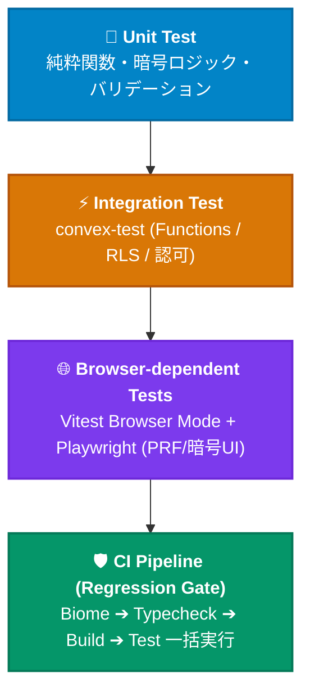
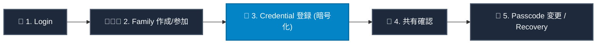

# Test Strategy

## 概要

PoohMa は Vitest（Node環境／ブラウザモード）、convex-test、Playwright（Chromium）を組み合わせてテストしている。本ドキュメントは実際のテストファイル構成に基づいてテストレイヤーの責務を整理したものであり、実装済みのテストのみを記載する。本稿はIssue #176「テスト戦略」に対する回答の下敷きとしても利用できる。

## テストレイヤーと責務

PoohMa には専用の「Regression Test」フェーズは独立して存在しない。GitHub Actions の単一ジョブ（`.github/workflows/ci.yml`）が `main` への push / PR ごとに Biome（Lint/Format）→ 型チェック（`tsc`）→ ビルド → `pnpm test` を一括実行し、これが事実上のリグレッションゲートとして機能している。

## Unit Test

純粋なロジック・バリデーションを対象とする、外部依存の薄いテスト。

| テストファイル | 対象 |
| --- | --- |
| `tests/crypto.spec.ts` | `src/lib/crypto.ts`（鍵導出・wrap/unwrap・encrypt/decrypt） |
| `tests/passcode-strength.spec.ts` | `@zxcvbn-ts` を用いたパスコード強度判定（Issue #162で強度要件を強化済み） |
| `tests/schemas.test.ts` | `src/utils/schemas.ts`（zodスキーマ） |
| `tests/record-form-validation.test.ts` | レコード入力フォームのバリデーションロジック |
| `tests/url-safety.test.ts` / `tests/url-safety-dns.spec.ts` | `src/utils/url-safety.ts`（SSRF対策のIP/DNS判定） |
| `tests/JpText.test.tsx` | 和文折り返しコンポーネント（budoux連携） |

## Integration Test（Convex Functions）

`convex-test` を用いて Convex の Query/Mutation をインメモリ実行し、DB操作を含めて検証する。

| テストファイル | 対象 |
| --- | --- |
| `tests/convex-accounts.spec.ts` | アカウント関連の関数群 |
| `tests/convex-users-auth.spec.ts` | ユーザー同期・認証コンテキスト解決（`resolveAccount`）。Issue #166で専用テストを拡充済み |
| `tests/convex-family.spec.ts` | 家族グループの作成・参加・招待 |
| `tests/convex-records.spec.ts` | サービスレコードのCRUD・検索・タグ |
| `tests/convex-rls.spec.ts` | `rls.ts` のアクセス制御（`requireContentAccess` / `requireAdminAccess`）。Issue #159でIntegration Testを拡充済み |
| `tests/convex-recovery.spec.ts` | リカバリーキー発行・OTP検証・復元フロー |
| `tests/convex-migrations.spec.ts` | 家族移行（`familyMigrations`）の準備・確定・中断。楽観的ロック検証（Issue #190）を含む |

## ブラウザ依存テスト

README に明記されている通り、暗号化やWebAuthnなど実ブラウザのAPI挙動に依存する部分は Vitest のブラウザモード（`@vitest/browser-playwright`, Chromium）で実行する。

| テストファイル | 対象 |
| --- | --- |
| `tests/biometric.spec.ts` | `src/lib/biometric.ts`（WebAuthn PRF拡張） |
| `tests/PasscodeProvider.spec.tsx` | パスコード解除・指数バックオフ・ロックアウトのUI/状態（Issue #192） |
| `tests/records-new.spec.tsx` | レコード新規登録画面（暗号化を伴うフォーム送信） |
| `tests/useRecordForm.spec.tsx` | レコードフォームの状態管理フック |
| `tests/recovery-kit.spec.ts` | リカバリーキットPDF/QR生成周りのロジック |

なお、E2EE / WebAuthn 主要フローの Browser E2E テストのさらなる拡充（Issue #160）は本稿執筆時点で open（対応中）であり、現状のカバレッジは今後拡張される見込みである。

## その他のテスト

| テストファイル | 対象 |
| --- | --- |
| `tests/firebase-admin.server.spec.ts` | サーバー側のFirebaseトークン検証（`checkRevoked`挙動を含む、Issue #187） |
| `tests/geo-ip.spec.ts` | ログイン通知等に用いるGeoIP解決 |
| `tests/email-templates.spec.ts` | React Emailテンプレートのレンダリング |
| `tests/faq.spec.ts` | microCMS連携のFAQ画面 |

コンポーネントカタログとして Storybook（`CredentialFieldsCard.stories.tsx` / `JpText.stories.tsx` / `RecordForm.stories.tsx`、a11yアドオン付き）を併用しており、自動テストというより見た目・アクセシビリティのレビュー用途として位置づけている。

## Critical User Flow とテストの対応

| フロー | 主な対応テスト |
| --- | --- |
| Login | `firebase-admin.server.spec.ts`, `convex-users-auth.spec.ts` |
| Family作成/参加 | `convex-family.spec.ts` |
| Credential登録（暗号化） | `crypto.spec.ts`, `records-new.spec.tsx`, `convex-records.spec.ts` |
| 共有確認 | `convex-rls.spec.ts`, `convex-records.spec.ts` |
| Passcodeのみのローテーション | `convex-family.spec.ts`（該当ケース）, `PasscodeProvider.spec.tsx` |
| Recovery | `convex-recovery.spec.ts`, `recovery-kit.spec.ts` |

## E2EE / Authentication / Authorization のテスト方針

- **E2EE**：`crypto.spec.ts` で鍵導出・wrap/unwrap・encrypt/decryptの正当性を単体で検証し、`convex-recovery.spec.ts` / `recovery-kit.spec.ts` でリカバリー経路の鍵到達性を検証する。README・SECURITY.md双方で「暗号鍵の生成・ラップ／アンラップ処理などセキュリティ上重要なロジックを変更した場合は、対応するテストの追加・更新を必須とする」ことを明文化している。
- **Authentication**：`firebase-admin.server.spec.ts` でトークン検証（`checkRevoked`含む）を、`convex-users-auth.spec.ts` でログイン時のユーザー同期・アカウント解決を検証する（Issue #166、closed）。
- **Authorization**：`convex-rls.spec.ts` でレコード単位のアクセス制御を検証する（Issue #159、closed。#167「重要な認可ロジックを高カバレッジ閾値の対象へ追加する」も closed）。一方、E2EE / WebAuthn 主要フローの Browser E2E テスト拡充（Issue #160）は open（対応中）。

## 関連ドキュメント

- [Architecture Overview](./architecture.md)
- [Security Model](./security/security-model.md)
- [Threat Model](./security/threat-model.md)

